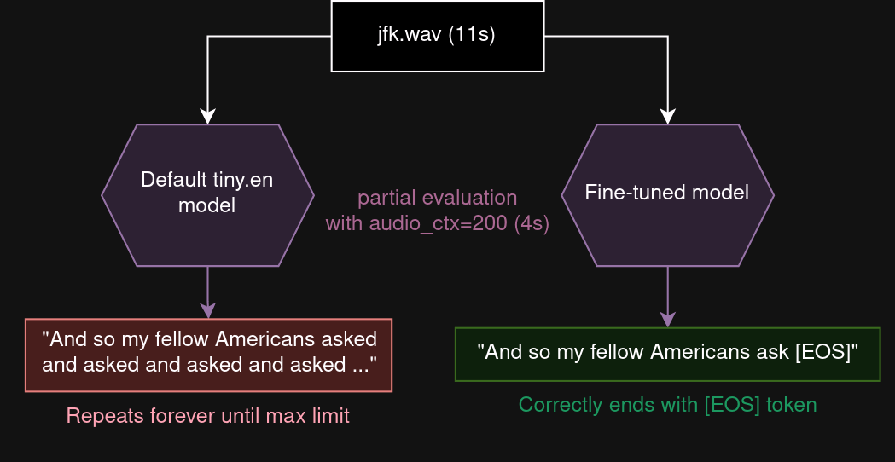
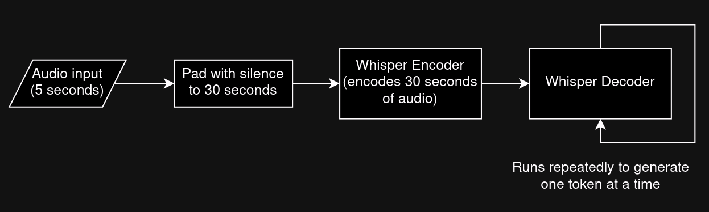
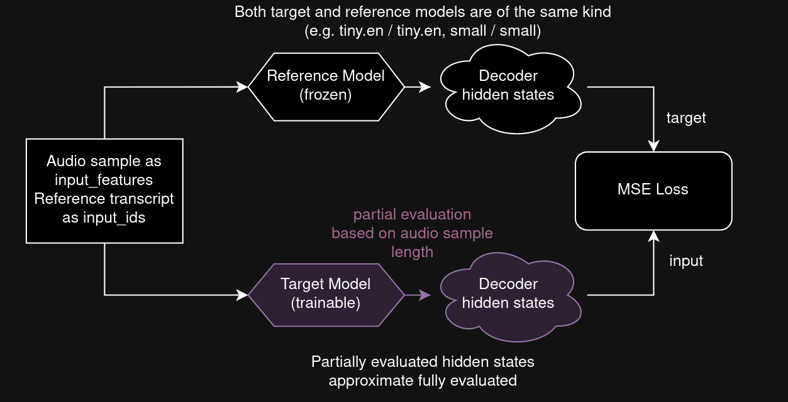

# How to Actually Do This

This guide walks through the full workflow: from raw audio files to corrected transcripts and training data for Whisper finetuning.

---

## 1. Prepare Your Audio Files

1. Collect all your audio files into a single directory.  
   - Example: `I:\Record`

---

## 2. Transcribe Audio Files with Groq

Use the Colab notebook to transcribe all audio files to JSON transcripts.

- Notebook:  
  `I:\P2GPT_google_drive\My Drive\Colab Notebooks\Transcribe_google_drive_with_groq.ipynb`

**Output:**

- Transcript JSON files saved to a directory, e.g.:  
  `I:\P2GPT_google_drive\My Drive\Transcriptions`

---

## 3. Rename Audio Files & Fix Bad Transcript Names

If the audio/transcript names are poor or inconsistent, use:

- Script: `rename_and_correct_transcripts_with_groq.py`
- Usage: 

```bash
python C:\Windows_software\whisper-acft\rename_and_correct_transcripts_with_groq.py --transcripts-dir "i:\P2GPT_google_drive\My Drive\Transcriptions" --audio-dir "i:\Record" --report rename_and_corrected_transcript_report.json --retry-backoff-base 2
```

This will:

- Propose better audio filenames.
- Fix transcript JSON `text` (basic corrections).
- Produce a JSON report of proposed changes.

---

## 4. Same as step 3 - Generate a Corrections Report

Run the script to generate a detailed corrections report:

```bash
python C:\Windows_software\whisper-acft\rename_and_correct_transcripts_with_groq.py --transcripts-dir "i:\P2GPT_google_drive\My Drive\Transcriptions" --audio-dir "i:\Record" --report rename_and_corrected_transcript_report.json --retry-backoff-base 2
```

**What this report includes:**

- Original audio name
- Proposed new audio name
- Transcript file path
- Corrected transcript text (including minor/grammatical and ASR corrections)

---

## 5. Apply Corrections from the Report

Use the report to update the actual JSON transcripts.

- Script: `apply_corrections_from_report.py`

Example (adjust paths as needed):

```bash
python "C:\Windows_software\whisper-acft\apply_corrections_from_report.py" ^
  --report "C:\Windows_software\whisper-acft\rename_and_corrected_transcript_report.json" ^
  --transcripts-dir "I:\P2GPT_google_drive\My Drive\Transcriptions" ^
  --output-dir "I:\P2GPT_google_drive\My Drive\Transcriptions_corrected"
```

**Result:**

- Cleaned / corrected transcript JSON files in:  
  `I:\P2GPT_google_drive\My Drive\Transcriptions_corrected`

---

## 6. Create Subtitle Files (VTT & ASS)

We now convert corrected JSON transcripts into subtitle formats for manual editing.
[CHATGPT conversation](https://chatgpt.com/c/694ec078-b8ac-8322-9c70-74019044d581)

- Script: `convert_json_transcripts_to_vtt_and_ass.py`

Example:

```bash
python "C:\Windows_software\whisper-acft\convert_json_transcripts_to_vtt_and_ass.py" ^
  --input-dir "I:\P2GPT_google_drive\My Drive\Transcriptions_corrected" ^
  --output-dir "I:\P2GPT_google_drive\My Drive\Transcriptions_corrected" ^
  --overwrite ^
  --workers 4 ^
  --write-ass
```

**This will:**

- Generate `.vtt` and `.ass` subtitle files.
- One subtitle file per transcript JSON.

> In future steps, `.ass` files will be opened and edited with [Subtitle Edit].

---

## 7. Manually Edit Subtitle Files

This is the tedious (but high-quality) manual correction phase.

1. **Copy subtitle files**  
   Copy the `.ass` (or `.vtt`) files into the directory that contains the **matching** audio files (same base filenames).

2. **Open with Subtitle Edit**
   - Launch Subtitle Edit.
   - Open the subtitle file (it should automatically load the corresponding audio file).

3. **Edit and save**
   - Correct text, timing, and formatting as needed.
   - Ensure auto-save is enabled or manually save frequently.
   - Repeat for all subtitle files.

**Goal:**  
High-quality, human-validated subtitles aligned to audio.

---

## 8. Sync Back Subtitle Changes to JSON Transcripts

Once subtitles are manually edited, those corrections should be applied back to the JSON transcripts.

> Placeholder: this step depends on your tooling/script.  
> The goal is to:
> - Read the edited subtitle files (ASS/VTT).
> - Align them with the existing JSON transcripts.
> - Replace/update segment texts and timings accordingly.

(Insert or implement the script/tool that performs this sync.)

---

## 9. Chunk Audio for Training (Sentence-Level Segments)

Use the chunking notebook to create training chunks and a manifest.

- Notebook:  
  `I:\P2GPT_google_drive\My Drive\Colab Notebooks\Chunking_for_Whisper_training_sentences.ipynb`

### 9.1. Create a Manifest File

The chunking process typically needs a **manifest** that references:

- Audio file paths
- Corresponding `transcript.json` files
- Segment `start`/`end` timestamps and text

The notebook will:

1. Read the corrected transcript JSONs.
2. Use per-sentence (or per-segment) `start` and `end` times.
3. Generate a manifest file describing all segments.

### 9.2. Perform Chunking

Using the manifest, the notebook will:

- Slice audio into chunks based on segment start/end times.
- Produce many smaller audio files suitable for training.

---

## 10. Train the Whisper Model

Once chunks and manifest are ready, run the training notebook.

- Notebook:  
  `I:\P2GPT_google_drive\My Drive\Colab Notebooks\Whisper_training_only.ipynb`

**Notes:**

- Strongly recommended: use a GPU (Colab, local GPU, or cloud).  
- CPU-only training is possible but very slow.

---

## 11. Evaluate the Trained Model

Finally, evaluate checkpoints from training.

- Script: `local_eval.py`  
  Example path:  
  `C:\Windows_software\whisper-acft\local_eval.py`

You can:

- Compare different checkpoints.
- Measure WER/CER on your evaluation set.
- Usually, later checkpoints perform best, but you should verify empirically.


---
&nbsp;

&nbsp;
---


# Finetuning Whisper for dynamic audio context robustness



The idea is to be able to set the `audio_ctx` parameter in whisper.cpp arbitrarily based on audio length (dynamic audio context), without needing to worry about the decoder freaking out and repeating itself.

Try the finetuned models with `-ac`/`--audio-context` argument in whisper.cpp:
* [tiny.en acft](https://voiceinput.futo.org/VoiceInput/tiny_en_acft_q8_0.bin)
* [base.en acft](https://voiceinput.futo.org/VoiceInput/base_en_acft_q8_0.bin)
* [small.en acft](https://voiceinput.futo.org/VoiceInput/small_en_acft_q8_0.bin)
* [tiny acft](https://voiceinput.futo.org/VoiceInput/tiny_acft_q8_0.bin)
* [base acft](https://voiceinput.futo.org/VoiceInput/base_acft_q8_0.bin)
* [small acft](https://voiceinput.futo.org/VoiceInput/small_acft_q8_0.bin)

We've not made versions for medium/large models, but you can make them yourself with the provided notebooks.

We provide safetensor checkpoints on [HuggingFace](https://huggingface.co/collections/futo-org/whisper-acft-667c430f8de3a22b73151d74).

## Motive and explanation for anyone uninitiated

The Whisper model is composed of two parts: the encoder which takes in 30 seconds of audio, and the decoder which outputs text.

The main source of latency between the model receiving audio and starting to output text is running the encoder. When running on resource-constrained devices such as phones, this latency can be big and it's important to minimize it in applications such as voice input.



One reason the encoder can be so slow is because the encoder input must always be 30 seconds. Even if the speech is 5 seconds long, it's necessary to add 25 seconds of silence and the encoder must "waste" processing time on those 25 seconds of nothing.

It'd be great if we could skip adding silence and just get the encoder to process whatever length of audio we have. In fact, we can and this is what the `audio_ctx` parameter in whisper.cpp does, which was [implemented after discussion here](https://github.com/ggerganov/whisper.cpp/issues/137).

Unfortunately, the model gets surprised by this and freaks out if you mess with this parameter too much. If you set it too low, usually the decoder doesn't know when to stop, and it'll repeat itself forever.

However, this issue can be mitigated by finetuning the model to tolerate dynamic audio context. The next section proposes a way to do this.

## Finetuning method

A model is loaded (e.g. tiny.en) and a copy of it is made. One will serve as the model to be trained (target model), and one will serve as a reference (reference model).

Given an audio sample and ground truth transcript, the hidden states for both models are calculated. The reference model is evaluated normally, while the target model's encoder is evaluated with dynamic `audio_ctx` based on the audio sample length. L2 loss is used on the hidden states, with the target being the reference model. Simply put, the behavior (hidden states) of the target model (being evaluated with dynamic audio context) is trained to match the reference model (being evaluated normally).



The idea behind this method is to try to preserve the model's knowledge as much as possible, only changing its behavior to match the original model.

## Results

Note: only the first 128 examples in each test set were used, see evaluation.ipynb

The WER on the finetuned model is slightly higher but not too different from the original models, and the WER is much lower than the normal models when using dynamic audio context.

The extreme WER values for the default model with dynamic audio context are caused by the models repeating themselves, causing a high number of insertions. Due to this, the WER can go over 100%.

```
librispeech clean tiny.en:
 * 4.73   - default model, audio_ctx=1500
 * 225.99 - default model, dynamic audio_ctx
 * 4.96   - finetuned model, audio_ctx=1500
 * 5.50   - finetuned model, dynamic audio_ctx
```

```
librispeech other tiny.en:
 * 16.17  - default model, audio_ctx=1500
 * 590.61 - default model, dynamic audio_ctx
 * 17.57  - finetuned model, audio_ctx=1500
 * 16.51  - finetuned model, dynamic audio_ctx
```

```
librispeech clean small.en:
 * 2.77 - default model, audio_ctx=1500
 * 79.7 - default model, dynamic audio_ctx
 * 2.88 - finetuned model, audio_ctx=1500
 * 2.81 - finetuned model, dynamic audio_ctx
```

Despite the finetuning data containing only English, the performance for other languages does not seem to decrease, potentially suggesting the idea of preserving the model's knowledge may have been effective.

```
VoxPopuli de base:
 * 22.47  - default model, audio_ctx=1500
 * 318.15 - default model, dynamic audio_ctx
 * 23.93  - finetuned model, audio_ctx=1500
 * 22.31  - finetuned model, dynamic audio_ctx
```

## Practical application

This was developed for and implemented in [FUTO Voice Input](https://voiceinput.futo.org) (v1.3.2+), an Android voice input application, to significantly decrease latency with short dictations, especially on low-end devices.
